# tap-to-tmux

Push notifications and one-tap deep links for AI agents running in **tmux** on a remote server.

<video src="https://github.com/user-attachments/assets/b95eb2c4-5d34-4d18-910f-3c484ca82490" controls width="800"></video>

## Table of contents

- [Who this is for](#who-this-is-for)
- [Key features](#key-features)
- [How it works](#how-it-works)
- [Tap-to-connect deep links](#tap-to-connect-deep-links)
- [Notification delivery](#notification-delivery)
- [Prerequisites](#prerequisites)
- [Installation](#installation)
- [Configuration](#configuration)
- [Claude Code hooks setup](#claude-code-hooks-setup)
- [Starting the services](#starting-the-services)
- [macOS setup](#macos-setup)
- [Health check](#health-check)
- [Troubleshooting](#troubleshooting)
- [Project structure](#project-structure)
- [Receiving notifications on desktop](#receiving-notifications-on-desktop)
- [Self-hosted ntfy server](#self-hosted-ntfy-server)
- [tap-to-tmux vs Claude Code Remote Control](#tap-to-tmux-vs-claude-code-remote-control)
- [FAQ](#faq)
- [Open tasks](#open-tasks)

## Who this is for

You run Claude Code, Codex, Gemini CLI, or other AI agents inside **tmux sessions** on a VPS, cloud instance, or any machine reachable via SSH. You walk away — to make coffee, take a call, work on something else. When an agent finishes, needs permission, or hits an error, **tap-to-tmux sends a push notification to your phone** with context about what happened. Tap the notification and [Blink Shell](https://blink.sh) opens an SSH connection straight into the exact tmux pane where the agent is waiting.

**tmux is required.** tap-to-tmux discovers sessions by walking the process tree to find parent tmux panes, builds deep links that attach to specific tmux sessions, and creates independent mobile viewports via grouped tmux sessions. Without tmux, the core notification and deep link features do not work.

The remote machine can be anything reachable via SSH — a cloud VPS, a dedicated server, or even your laptop on the same network or connected via [Tailscale](https://tailscale.com).

## Key features

- **Push notifications** via [ntfy](https://ntfy.sh) with rich context (task, last response, project name)
- **Tap-to-connect deep links** via [Blink Shell](https://blink.sh) — one tap from notification to the right tmux pane
- **Any agent in tmux** — Claude Code, Codex, Gemini CLI, or anything else running in a tmux session
- **Smart deduplication** — one notification per project, cooldown resets on interaction
- **Active-pane suppression** — optionally skip notifications when you're already looking at the pane
- **Multi-agent dashboard** via optional [NTM](https://github.com/cyanheads/ntm) polling with CPU-based activity detection
- **Extensible delivery** — ntfy and Slack built-in; hook architecture pipes to Discord, Telegram, Teams, email, or any webhook with minimal code

## How it works

tap-to-tmux has two notification layers:

1. **Claude Code hook** (`tmux-notify.sh`) — Fires on CC lifecycle events (`Notification`, `Stop`). Extracts context from the session transcript (what task was running, what Claude's last response was). Sends rich notifications with project name, machine name, and context.

2. **NTM agent monitor** (`ntm-notify-monitor.sh`) — Polls [NTM](https://github.com/cyanheads/ntm) health for non-CC agents (Codex, Gemini CLI, etc.) and sends notifications when they go idle or error. Optional — only needed if you run multiple agent types.

Both layers deliver via [ntfy](https://ntfy.sh) (push notifications) out of the box, with built-in Slack support and an extensible hook architecture that can pipe to [any notification service](#notification-delivery).

### Notification types

| Event | Title | Priority |
|-------|-------|----------|
| Permission needed | `machine/project [cc]: Permission Needed` | High |
| Waiting for input | `machine/project [cc]: Waiting for Input` | Default |
| Session finished | `machine/project [cc]: Done` | Default |
| NTM agent idle | `machine/project [agent] p0: Idle` | Default |

### Smart deduplication

You get **one notification per project** when something needs attention, then silence until the cooldown expires (24h default). The cooldown resets when you interact with the session — so you'll get notified again next time it's idle.

## Tap-to-connect deep links

The deep link system is the core UX of tap-to-tmux. When configured, every notification includes a `blinkshell://` URL that opens [Blink Shell](https://blink.sh) on iOS, SSH's into your server, and attaches to the exact tmux session and pane where Claude is waiting — all from a single tap.

### How the deep link flow works

```mermaid
stateDiagram-v2
    [*] --> CC_Event: Claude Code fires hook<br/>(Notification / Stop)

    CC_Event --> SessionDiscovery: tmux-notify.sh runs

    state SessionDiscovery {
        [*] --> WalkProcessTree: Walk PID tree upward
        WalkProcessTree --> FoundSession: Match PID to<br/>tmux pane
        WalkProcessTree --> FallbackProject: No match →<br/>use project name
        FoundSession --> [*]
        FallbackProject --> [*]
    }

    SessionDiscovery --> BuildURL: Session + pane index known

    state BuildURL {
        [*] --> CheckBlinkKey: BLINK_KEY set?
        CheckBlinkKey --> Construct: Yes → build SSH command
        CheckBlinkKey --> NoLink: No → skip deep link
        Construct --> URLEncode: URL-encode via Python
        URLEncode --> BlinkURL: blink URL with key + encoded cmd
        BlinkURL --> [*]
        NoLink --> [*]
    }

    BuildURL --> SendNotification: Notification with deep link

    state SendNotification {
        [*] --> NtfyRequest: POST to ntfy server
        NtfyRequest --> SetHeaders: Set Click + Actions<br/>headers with blink URL
        SetHeaders --> Delivered: Push notification sent
        Delivered --> [*]
    }

    SendNotification --> PhoneNotification: Notification arrives on phone

    state PhoneNotification {
        [*] --> UserTaps: User taps notification<br/>or "Connect" button
        UserTaps --> BlinkOpens: iOS opens<br/>Blink Shell deep link
        BlinkOpens --> [*]
    }

    PhoneNotification --> MobileAttach: Blink Shell executes SSH command

    state MobileAttach {
        [*] --> CleanStale: Kill orphaned mob-* sessions
        CleanStale --> ValidateSession: Target session exists?
        ValidateSession --> CreateGrouped: Yes → create grouped mob-PID session
        ValidateSession --> Error: No → exit with error
        CreateGrouped --> ConfigureViewport: window-size latest<br/>status off
        ConfigureViewport --> SelectPane: select-pane + zoom hook
        SelectPane --> Attach: tmux attach
        Attach --> [*]
    }

    MobileAttach --> Connected: User is in the right<br/>tmux pane, zoomed

    Connected --> [*]: Session ends or<br/>user detaches<br/>(mob-* cleaned up on exit)
```



### What happens when you tap

1. **Notification arrives** — ntfy shows the notification with a "Connect" action button
2. **Tap opens Blink** — iOS launches Blink Shell via the `blinkshell://run?key=...&cmd=...` URL
3. **SSH connects** — Blink runs `ssh -t user@host tmux-mobile-attach.sh SESSION PANE`
4. **Mobile viewport created** — A grouped tmux session (`mob-PID`) gives you an independent viewport sized for your phone screen
5. **Pane zoomed** — The exact pane where Claude is waiting gets selected and zoomed to fill the screen
6. **Cleanup on exit** — When you detach, the `mob-*` session is automatically destroyed

### Why grouped sessions?

The mobile attach script creates a *grouped* tmux session (`mob-$$`) rather than attaching directly. Grouped sessions share the same windows but can have independent settings — which lets mobile get its own `window-size latest` viewport sized for your phone.

**Desktop resize behavior:** when your phone connects, the shared window will temporarily un-zoom on your desktop — this is a tmux constraint, not a bug. As soon as you close Blink and disconnect, the `mob-*` session is destroyed and your desktop resumes its normal layout automatically. The pane you're connected to also gets zoomed on mobile, so your phone shows one focused pane rather than a scaled-down version of your full layout.

Other benefits:
- Multiple mobile connections don't interfere (each gets its own `mob-*` session)
- Stale connections from dropped SSH sessions are cleaned up automatically
- The `mob-*` session is destroyed on detach — no tmux cruft accumulates

### Requirements for deep links

- [Blink Shell](https://blink.sh) installed on iOS
- `BLINK_KEY` set in config (find it in Blink Settings > x-callback-url)
- `SSH_USER` and `SSH_HOST` pointing to your VPS (can be a Tailscale hostname)

> **Without Blink Shell:** Notifications still work — you just won't get the tap-to-connect button. You can still SSH in manually using the session info in the notification body.


### NTM dashboard

If you use [ntm](https://github.com/flavio87/tap-to-tmux) to manage multiple agent sessions, the NTM dashboard gives you a live overview of every session from your phone — with per-agent Connect buttons that tap directly into Blink:


Each card shows the session name, which agents are present (Claude Code, Codex, Gemini), their activity state (**working now**, **idle since [time]**, or **idle**), and a **Connect** button that fires the same Blink deep link as a notification tap. The **Overview** button attaches to the session's first pane without zooming.

Activity detection uses CPU-tick sampling from `/proc/PID/stat` — not self-reported agent status — with debouncing to filter out idle-loop noise. Timestamps persist across dashboard restarts.

## Notification delivery

tap-to-tmux's hook system extracts rich context from your agent sessions — task name, last response, project, machine, event type — and pipes it to any notification service. ntfy and Slack are built-in. Adding new destinations is straightforward because the architecture is simple: shell functions that receive structured data and `curl` it to an endpoint.

### Built-in destinations

| Destination | Status | Config variable | What you get |
|-------------|--------|-----------------|--------------|
| [ntfy](https://ntfy.sh) | Built-in | `NTFY_TOPIC` | Push notifications on iOS/Android with priority, tags, action buttons, and Blink deep links |
| [Slack](https://slack.com) | Built-in | `SLACK_WEBHOOK_URL` | Formatted messages via incoming webhook with project context |

### Adding new destinations

Each notification destination is a shell function that receives title, priority, body, and the Blink deep link URL. Adding a new one means writing a function in `scripts/ntfy-notify-common.sh` and calling it from the hook. Here's what the most popular integrations look like:

| Destination | Effort | How it works |
|-------------|--------|--------------|
| [Discord](https://discord.com) | ~20 lines | Incoming webhook — almost identical to Slack. POST JSON with `content` and `embeds` to your webhook URL. |
| [Telegram](https://telegram.org) | ~30 lines | Bot API — `curl` POST to `api.telegram.org/bot<TOKEN>/sendMessage` with `chat_id` and formatted text. Create a bot via [@BotFather](https://t.me/botfather). |
| [Pushover](https://pushover.net) | ~15 lines | Simple HTTP API — POST `token`, `user`, `title`, `message`, and optional `url` (for deep link). One of the easiest integrations. |
| [Microsoft Teams](https://www.microsoft.com/en-us/microsoft-teams) | ~30 lines | Incoming webhook or Workflows connector — POST an Adaptive Card JSON payload. |
| [Email](https://en.wikipedia.org/wiki/Email) | ~25 lines | `sendmail`, `msmtp`, or `curl` via SMTP relay. Useful for logging or team-wide alerts. |
| [PagerDuty](https://www.pagerduty.com) | ~35 lines | Events API v2 — POST a `trigger` event with `routing_key`, severity, and summary. Good for on-call workflows. |
| [Gotify](https://gotify.net) | ~15 lines | Self-hosted push server — POST `title` and `message` to your Gotify instance. Similar to ntfy but self-hosted only. |
| Generic webhook | ~10 lines | `curl` POST a JSON payload to any URL. Works with Zapier, Make, n8n, IFTTT, or any HTTP endpoint. |

### Example: adding Discord

```bash
# Add to scripts/ntfy-notify-common.sh
send_discord_notification() {
    local title="$1" priority="$2" body="$3" blink_url="$4"
    [[ -z "${DISCORD_WEBHOOK_URL:-}" ]] && return 0

    local color=3447003  # blue
    [[ "$priority" == "high" || "$priority" == "urgent" ]] && color=15158332  # red

    curl -s -o /dev/null -X POST "$DISCORD_WEBHOOK_URL" \
        -H "Content-Type: application/json" \
        -d "$(jq -n \
            --arg title "$title" \
            --arg body "$body" \
            --arg url "${blink_url:-}" \
            --argjson color "$color" \
            '{embeds: [{title: $title, description: $body, color: $color, url: $url}]}'
        )"
}
```

Then add `DISCORD_WEBHOOK_URL=""` to your `config.env` and call the function from the hook. The same pattern works for any destination.

### Architecture

The hook system is intentionally simple — no plugin framework, no message bus. Each destination is an independent `curl` call fired in the background. This means:

- **No single point of failure** — if Discord's webhook is down, ntfy still delivers
- **No dependencies** — each destination only needs `curl` and `jq`
- **Easy to test** — call any send function directly from the command line
- **Parallel delivery** — all destinations fire concurrently via background jobs

## Prerequisites

- **Required:** [tmux](https://github.com/tmux/tmux) — your agents must run inside tmux sessions
- **Required:** `jq`, `curl`, `python3`
- **Required:** [ntfy](https://ntfy.sh) app on your phone (iOS/Android)
- **Required:** A machine reachable via SSH (VPS, cloud instance, or local machine on Tailscale/LAN)
- **Recommended:** [Blink Shell](https://blink.sh) — iOS SSH client for tap-to-connect deep links
- **Optional:** [NTM](https://github.com/cyanheads/ntm) — needed for the multi-agent monitor

## Installation

```bash
git clone https://github.com/flavio87/tap-to-tmux.git
cd tap-to-tmux
./install.sh
```

The installer:
1. Copies `config.env` template to `~/.config/tap-to-tmux/config.env`
2. Installs scripts to `~/.local/bin/`
3. Installs Claude Code hooks to `~/.claude/hooks/`
4. Installs systemd user units (optional auto-start daemons)

Then edit your config:

```bash
nano ~/.config/tap-to-tmux/config.env
```

## Configuration

All settings live in `~/.config/tap-to-tmux/config.env`:

| Variable | Required | Description |
|----------|----------|-------------|
| `NTFY_TOPIC` | Yes | Unique topic name for your notification channel. Generate one: `python3 -c "import secrets; print(f'tap-to-tmux-{secrets.token_hex(8)}')"` |
| `MACHINE` | No | Display name in notification titles. Defaults to hostname. |
| `SSH_USER` | No | Username for deep link SSH commands. Defaults to current user. |
| `SSH_HOST` | No | Hostname/IP for deep link SSH commands. Defaults to hostname. On macOS with Tailscale, set this to your Tailscale MagicDNS name (e.g. `my-mac.tail1234.ts.net`). |
| `SSH_REMOTE_HOME` | No | Home directory path on the remote machine. Defaults to `/home/$SSH_USER`. **macOS users must set this** to `/Users/$SSH_USER` since macOS uses `/Users/` not `/home/`. |
| `NTFY_SERVER` | No | ntfy server URL. Defaults to `https://ntfy.sh` (public). Set to your self-hosted URL if desired. |
| `NTFY_TOKEN` | No | Auth token for self-hosted ntfy servers with access control (`auth-default-access: deny`). Generate via `docker exec ntfy ntfy token add USERNAME`. Not needed for the public ntfy.sh server. |
| `BLINK_KEY` | No | Blink Shell x-callback-url key for tap-to-connect on iOS. Leave empty to disable deep links. |
| `SLACK_WEBHOOK_URL` | No | Slack incoming webhook URL for dual delivery. Leave empty to disable. |
| `PROJECTS_DIR` | No | Directory containing your project repos. Defaults to `$HOME/projects`. Used by the NTM monitor for session matching. |
| `NOTIFY_EXCLUDE_DIRS` | No | Colon-separated path prefixes that will never trigger notifications. Example: `/data/notes:/home/user/scratch`. Useful for personal notes or low-signal dirs. |
| `NOTIFY_EXCLUDE_SESSIONS` | No | Colon-separated glob patterns matched against tmux session names. Matching sessions are skipped by the NTM monitor. Example: `autonomous-*:batch-*:tmp-*`. Useful for noisy automated sessions. |
| `SUPPRESS_WHEN_ACTIVE` | No | Skip notifications when the tmux pane is actively focused. `"none"` (default) = always notify; `"pane"` = suppress if the pane and its window are both active. Useful when you're already looking at the agent. |

## Claude Code hooks setup

Add to your Claude Code settings (`~/.claude/settings.json`):

```json
{
  "hooks": {
    "Notification": [
      {
        "matcher": "",
        "hooks": ["~/.claude/hooks/tmux-notify.sh"]
      }
    ],
    "Stop": [
      {
        "matcher": "",
        "hooks": ["~/.claude/hooks/tmux-notify.sh"]
      }
    ],
    "UserPromptSubmit": [
      {
        "matcher": "",
        "hooks": ["~/.claude/hooks/ntfy-cooldown-clear.sh"]
      }
    ]
  }
}
```

The `Notification` hook fires on permission prompts and idle events. The `Stop` hook fires when a session finishes. The `UserPromptSubmit` hook clears the cooldown so you'll get notified again next time.

## Starting the services

```bash
# NTM agent monitor (optional — only if you use NTM)
systemctl --user enable --now ntm-notify-monitor

# NTM serve daemon (optional — powers the dashboard)
systemctl --user enable --now ntm-serve

# Status dashboard (optional — web UI at port 7338)
systemctl --user enable --now ntm-dashboard
```

## macOS setup

tap-to-tmux works on macOS with a few extra steps. The main differences from a Linux VPS: tmux is installed via Homebrew, SSH is managed by macOS System Settings, and Tailscale is the easiest way to make your Mac reachable from your phone when you're away from home.

### 1. Install tmux

```bash
brew install tmux
```

### 2. Configure your connection details

In `~/.config/tap-to-tmux/config.env`, macOS requires two settings that differ from Linux defaults:

```bash
# macOS home is /Users/, not /home/
SSH_REMOTE_HOME="/Users/your-username"

# Use Tailscale MagicDNS for reliable remote access
SSH_HOST="your-mac.tail1234.ts.net"
```

To find your Tailscale hostname: `tailscale status | head -1` — it looks like `your-mac.tail1234.ts.net`.

### 3. Enable SSH (Remote Login)

**System Settings → General → Sharing → Remote Login → On**

Make sure your user is listed under "Allow access for".

### 4. Restrict SSH to Tailscale only (recommended)

By default macOS sshd listens on all interfaces. To restrict it to Tailscale only, use `pf` firewall rules. First find your Tailscale interface and iPhone's Tailscale IP:

```bash
# Find your Tailscale interface (the one with your 100.x.x.x IP)
ifconfig | grep -B5 '100\.' | grep '^utun'

# Find your iPhone's Tailscale IP
tailscale status | grep -i iphone
```

Then create a pf anchor — replace `utunX` with your interface and `100.x.x.x` with your iPhone's IP:

```bash
sudo tee /etc/pf.anchors/tap-to-tmux << 'EOF'
pass in quick on utunX proto tcp from 100.x.x.x to any port 22
block in quick on utunX proto tcp to port 22
EOF
```

Add to `/etc/pf.conf` (before the final blank line):

```
anchor "tap-to-tmux"
load anchor "tap-to-tmux" from "/etc/pf.anchors/tap-to-tmux"
```

Load the rules:

```bash
sudo pfctl -ef /etc/pf.conf
```

> **Note:** The `pass` rule must come before the `block` rule — pf uses `quick` to stop on first match.

### 5. Set up Blink Shell for deep links

In [Blink Shell](https://blink.sh) on your iPhone:

1. **Add a host:** Settings → Hosts → + → set Hostname to your Tailscale address, User to your Mac username, and select your SSH key
2. **Get your x-callback-url key:** Settings → Advanced → x-callback-url — copy the key
3. **Add to config:** set `BLINK_KEY` in `~/.config/tap-to-tmux/config.env`
4. **Add your Mac's public key to Blink** (or generate one in Blink and add it to `~/.ssh/authorized_keys` on your Mac)

### 6. Always start inside tmux — or better, use NTM to spawn a full multi-agent setup

Deep links attach to the specific tmux session where your agent is running. For a single agent, start a named tmux session manually:

```bash
# Outside tmux — creates a clean standalone session
tmux new-session -d -s myproject
tmux attach -t myproject
# Now run: claude
```

> **Tip:** Avoid creating sessions from inside an existing tmux window — tmux will auto-append `-1` to the session name, which can cause stale deep links.

Or better yet, use **[NTM](https://github.com/Dicklesworthstone/ntm)** — a CLI that spawns and tiles multiple AI agents (Claude Code, Codex, Gemini) across tmux panes in one command:

```bash
# Install
brew install dicklesworthstone/tap/ntm
# or: curl -fsSL https://raw.githubusercontent.com/Dicklesworthstone/ntm/main/install.sh | bash

# Launch a multi-agent setup: 1 Claude Code + 1 Codex in a named session
ntm spawn myproject --cc=1 --cod=1
```

Panes are auto-labeled (`myproject__cc_1`, `myproject__cod_1`). tap-to-tmux hooks and deep links work with NTM-spawned sessions out of the box — each pane gets its own notification and one-tap connect link.

### Verify everything works

```bash
ntfy-health-check.sh --send-test
```

A test notification should arrive on your phone. Tap it — Blink should SSH into your Mac and attach to the tmux session.

## Health check

Run the built-in health check to verify your setup:

```bash
ntfy-health-check.sh              # check config + tools
ntfy-health-check.sh --send-test  # also send a test notification
```

## Troubleshooting

**No notifications received:**
1. Run `ntfy-health-check.sh --send-test` — does the test notification arrive?
2. Check `NTFY_TOPIC` in your config matches the topic you subscribed to in the ntfy app
3. Check logs: `cat /tmp/tap-to-tmux-logs/tmux-notify.log`

**Notifications arrive but show no content (empty body on iOS):**
- Your ntfy server requires authentication. The app is receiving the push ping but getting 403 when fetching the message body.
- Fix: re-subscribe in the ntfy app with username + password. See [Subscribing on iOS with a self-hosted authenticated server](#subscribing-on-ios-with-a-self-hosted-authenticated-server).

**HTTP 403 errors in the notification log:**
- Check `cat /tmp/tap-to-tmux-logs/ntfy-notify.log` for `FAILED HTTP 403` lines.
- Your server likely has `auth-default-access: deny`. Each machine's unique topic needs an ACL entry, or the machine needs an `NTFY_TOKEN` in its `config.env`. The server machine may work without a token if anonymous has explicit access to its topic, but remote machines (MacBook, etc.) will get 403 for their own topics.
- Fix: set `NTFY_TOKEN` in `~/.config/tap-to-tmux/config.env` and grant the user access: `docker exec ntfy ntfy access <user> <topic> rw`. See [Self-hosted ntfy server](#self-hosted-ntfy-server).

**Duplicate notifications:**
- The cooldown system should prevent these. Check: `ls -la /tmp/tap-to-tmux-cooldown/`
- Default cooldown is 24h. Override with `NTFY_COOLDOWN_SECONDS` in config.

**Deep links not working:**
- Blink Shell deep links require `BLINK_KEY` to be set. Find it in Blink Settings → Advanced → x-callback-url.
- Other SSH clients: set `SSH_USER` and `SSH_HOST`, then use the notification body to manually SSH in.
- **macOS:** Make sure `SSH_REMOTE_HOME="/Users/your-username"` is set — the default `/home/` path doesn't exist on macOS and the script won't find itself.

**Deep link says "session does not exist" (macOS):**
- The tmux session name in the deep link must exactly match `tmux list-sessions`. Check for an unexpected `-1` suffix — this happens when you create a session from inside an existing tmux window (it becomes a grouped session). Create sessions from outside tmux: `tmux new-session -d -s name`.
- Make sure `tmux` is on the PATH in SSH sessions: add `export PATH="/opt/homebrew/bin:$PATH"` to `~/.zprofile`.

**SSH connection refused from Blink (macOS):**
- Confirm Remote Login is on: System Settings → General → Sharing → Remote Login.
- If you set up pf rules, confirm your iPhone's Tailscale IP hasn't changed: `tailscale status | grep iphone`. Update `/etc/pf.anchors/tap-to-tmux` and reload with `sudo pfctl -ef /etc/pf.conf` if it has.

**NTM monitor not detecting agents:**
- Verify NTM is installed: `ntm --version`
- Check if sessions are visible: `ntm health --json`
- Logs: `cat /tmp/tap-to-tmux-logs/ntm-notify-monitor.log`

## Project structure

```
hooks/                  # Claude Code lifecycle hooks
  tmux-notify.sh          # Main notification hook (Notification + Stop events)
  ntfy-cooldown-clear.sh  # Cooldown reset on user interaction
scripts/                # Core scripts
  ntfy-notify-common.sh   # Shared library (config, logging, deep links, sending)
  ntm-notify-monitor.sh   # NTM agent polling monitor
  ntm-dashboard-server.py # Status dashboard HTTP server
  ntfy-health-check.sh    # Pipeline health check
  ntfy-broadcast-status.sh # Broadcast status to all subscribers
  tmux-mobile-attach.sh   # SSH helper for mobile deep links
dashboard/              # Web dashboard
  status.html             # Mobile-first status page
systemd/                # Linux systemd user units
  ntm-notify-monitor.service
  ntm-dashboard.service
  ntm-serve.service

launchd/                # macOS launchd agents
desktop/                # macOS desktop integration (AppleScript, handlers)
server/                 # Self-hosted ntfy server config (Docker)
config.env              # Configuration template
install.sh              # Installer
```

## Self-hosted ntfy server

If you prefer not to use the public ntfy.sh server, the `server/` directory includes a Docker Compose setup:

```bash
cd server
docker compose up -d
```

Edit `server/server.yml` with your domain, then set `NTFY_SERVER` in your config.

### Authentication (self-hosted)

If your server uses `auth-default-access: deny` (recommended), create a user and grant topic access:

```bash
# Create a user (password set via env var to avoid interactive prompt)
docker exec -e NTFY_PASSWORD=yourpassword ntfy ntfy user add --role=user tap-to-tmux

# Grant read-write access to your topic
docker exec ntfy ntfy access tap-to-tmux your-topic-name rw

# Create an access token (used by tap-to-tmux scripts to publish)
docker exec ntfy ntfy token add --label="tap-to-tmux" tap-to-tmux
```

Add the generated token (`tk_...`) to `~/.config/tap-to-tmux/config.env` on every machine that publishes to this server:

```bash
NTFY_TOKEN="tk_yourtokenhere"
```

### Subscribing on iOS with a self-hosted authenticated server

The ntfy iOS app requires a **username and password** to subscribe to a protected topic — it does not support token-only auth in its subscribe dialog. Use the password you set when creating the user above.

In the ntfy iOS app:
1. Tap **+** → enter your server URL (e.g. `https://ntfy.yourdomain.com`)
2. Enter your topic name
3. When prompted for credentials: **username** = your ntfy username, **password** = the password you set
4. Tap Subscribe

The iOS app will use those credentials to fetch message content. The access token (`NTFY_TOKEN`) is used separately by tap-to-tmux scripts to publish notifications from your server/machines.

> **Troubleshooting:** If you receive empty push notifications (no body content visible), the app is likely subscribed without auth — it receives the push ping but gets 403 when fetching the message. Delete and re-add the subscription with credentials.

## Receiving notifications on desktop

The ntfy app handles iOS and Android natively. For desktop, you have two paths: ntfy (macOS-specific options) or Slack (works everywhere).

### macOS

Three options depending on your hardware:

**Safari PWA — simplest, any Mac (macOS Sonoma+)**

Works on any Mac running macOS 14 (Sonoma) or later. No app to install.

1. Open Safari and go to your ntfy server (e.g. `https://ntfy.sh` or your self-hosted URL)
2. Subscribe to your `NTFY_TOPIC`
3. Click **Share → Add to Dock**
4. macOS will ask for notification permission — allow it
5. Notifications arrive even when Safari is closed

**Limitation:** Safari Web Push is silent (no sound). If you need sound, use one of the options below.

**Official ntfy app — full features, Apple Silicon only**

The [official ntfy app](https://apps.apple.com/us/app/ntfy/id1625396347) is on the Mac App Store (free, by ntfy's author). Supports sound, action buttons, formatted messages, and self-hosted servers. **Requires M1 or later** — Intel Macs not supported.

1. Install ntfy from the Mac App Store
2. Open the app → tap **+**
3. Enter your ntfy server URL and topic
4. Enable notifications in **System Settings → Notifications → ntfy**

**ntfy-desktop — Intel + Apple Silicon, polling-based**

[ntfy-desktop by Aetherinox](https://github.com/Aetherinox/ntfy-desktop) is an Electron app that works on all Macs. Polls for notifications rather than using Web Push — slightly higher resource usage but works on Intel.

1. Download the latest `.dmg` from [GitHub releases](https://github.com/Aetherinox/ntfy-desktop/releases)
2. Open the `.dmg`, drag ntfy-desktop to Applications
3. Launch it — runs in the system tray
4. Click **+** to add your topic and server URL

| | Sound | Background delivery | Intel Mac | Self-hosted |
|---|---|---|---|---|
| Safari PWA | Silent only | Yes (Web Push) | Yes | Yes |
| Official app | Yes | Yes (Web Push) | No (M1+ only) | Yes |
| ntfy-desktop | Yes | Yes (polling) | Yes | Yes |

### macOS, Windows, Linux — via Slack

Set `SLACK_WEBHOOK_URL` in your config and every notification also posts to a Slack channel. The Slack desktop app delivers these as native OS notifications with sound on any platform. No extra setup beyond the webhook — and it means your agents can page both your phone (ntfy) and your desktop (Slack) at the same time.

## tap-to-tmux vs Claude Code Remote Control

Claude Code has built-in [Remote Control](https://docs.anthropic.com/en/docs/claude-code/remote-control) — connect from your phone via `claude.ai/code` or the Claude iOS app. Remote Control and tap-to-tmux solve overlapping problems in different ways, and they work well together. Remote Control gives you a web-based window into Claude Code sessions with in-app push notifications. tap-to-tmux gives you multi-provider monitoring, full terminal access, multi-destination notifications with rich context, and infrastructure you control.

### Two different philosophies

**Remote Control** is a web relay for Claude Code sessions. You open the Claude app, see your session, type a response. It supports push notifications within the Claude app, server mode with multiple concurrent sessions (up to 32 with worktree isolation), and integrations with `/goal` for autonomous multi-turn execution. Setup is zero-config — scan a QR code and go.

**tap-to-tmux + Blink Shell** is built for tmux-based workflows with any AI agent. tap-to-tmux watches your sessions (Claude Code, Codex, Gemini CLI, Aider — anything in tmux), pushes notifications to any destination (ntfy, Slack, Discord, Telegram, email), and gives you one-tap deep links that land you in the right tmux pane via Blink Shell — with your full terminal environment, layout, and tools.

### Comparison across five dimensions

#### 1. Awareness — how do you know something needs attention?

| | Remote Control | tap-to-tmux + Blink |
|---|---|---|
| **Push notifications** | Yes — in-app push via Claude iOS/Android app | Yes — ntfy push to lock screen, plus Slack, Discord, Telegram, email, any webhook |
| **Notification content** | Agent needs attention (basic) | Rich context: task summary, last response, project name, machine name |
| **Notification destinations** | Claude app only | Any combination: ntfy, Slack, Discord, Telegram, Teams, email, PagerDuty, webhooks |
| **Notification history** | None — ephemeral | ntfy retains a searchable timeline; Slack provides a permanent channel log |
| **Non-CC agents** | Not monitored | Codex, Gemini CLI, Aider — any agent in tmux gets the same notifications |
| **Per-project deduplication** | N/A | One notification per project, cooldown resets on interaction |

Both tools push notifications. Remote Control notifies within the Claude app. tap-to-tmux delivers to any service — including your lock screen via ntfy, a Slack channel your team watches, or a PagerDuty on-call rotation — with richer context about what happened and what the agent was working on.

#### 2. Getting there — how do you connect?

| | Remote Control | tap-to-tmux + Blink |
|---|---|---|
| **Initial setup** | `/remote-control` in session, scan QR | Install tap-to-tmux, configure ntfy + Blink key |
| **Reconnecting** | Open Claude app → find session | Tap notification → Blink opens → SSH → tmux pane (one tap) |
| **What you land in** | Web-based chat view in a browser/app | Native terminal (Blink Shell) attached to your tmux session |
| **Pane targeting** | Lands in the session (no pane control) | Deep link targets the exact pane where the agent is waiting, zoomed |

#### 3. The experience once connected

| | Remote Control | tap-to-tmux + Blink |
|---|---|---|
| **Interface** | Web UI (responsive, but browser-based) | Full native terminal via Blink Shell |
| **Live terminal state** | Message relay — conversation syncs, but unsent input doesn't appear on other devices | Same tmux session — what you type on your phone appears on your desktop instantly |
| **Access other tools** | No — scoped to the Claude Code session | Yes — full shell, other panes, vim, git, anything |
| **Custom tmux layouts** | No — web renders its own view | Yes — your desktop layout is preserved; mobile gets an independent viewport |
| **Terminal features** | Limited (web rendering) | Full (Blink supports mosh, key forwarding, themes, fonts) |

With tap-to-tmux + Blink, you're attached to your actual tmux session — there's no relay layer. Remote Control gives you a Claude-scoped web view; Blink gives you your full terminal environment.

#### 4. Scale — multiple agents and projects

| | Remote Control | tap-to-tmux + Blink |
|---|---|---|
| **Multiple CC sessions** | Server mode supports up to 32 concurrent sessions with worktree isolation | One notification per session, each with its own deep link |
| **Dashboard / overview** | Session list and agent view in web UI | NTM dashboard shows all agents across all providers with CPU-based activity detection |
| **Non-CC agents** (Codex, Gemini CLI, etc.) | Not supported | Fully supported via NTM polling |
| **Per-project deduplication** | N/A | One notification per project, cooldown until you interact |

#### 5. Infrastructure and privacy

| | Remote Control | tap-to-tmux + Blink |
|---|---|---|
| **Traffic routing** | Session data through Anthropic's servers | Direct SSH to your machine (nothing leaves your infra) |
| **Self-hosted option** | No | Yes — self-hosted ntfy server |
| **Multi-destination delivery** | Claude app only | ntfy, Slack, Discord, Telegram, Teams, email, any webhook |
| **Offline tolerance** | ~10 min timeout, then session drops | tmux sessions persist indefinitely; reconnect anytime |
| **Auth requirements** | claude.ai subscription (no API keys, Bedrock, Vertex) | Any SSH-accessible machine |

### When to use which

| Scenario | Best tool | Why |
|----------|-----------|-----|
| Quick check on a single CC session from your couch | **Remote Control** | Simplest path — QR code, zero config |
| Walk away for hours, come back only when needed | **tap-to-tmux** | Rich push notifications to your lock screen, not just the Claude app |
| Running 3+ CC agents across different projects | **tap-to-tmux + NTM** | Per-project notifications + cross-provider dashboard |
| Mixed agents (CC + Codex + Gemini CLI) | **tap-to-tmux + NTM** | Only option — Remote Control is CC-only |
| tmux power user (custom layouts, splits, persistent sessions) | **tap-to-tmux + Blink** | You stay in your real terminal environment |
| Need to check logs, run tests, or use other tools from mobile | **tap-to-tmux + Blink** | Full shell access, not just a Claude session view |
| Team visibility (Slack channel, PagerDuty, email) | **tap-to-tmux** | Multi-destination delivery to any service your team uses |
| Self-hosted / air-gapped infrastructure | **tap-to-tmux** | Direct SSH, self-hosted ntfy, no Anthropic relay |
| Both — interactive when active, async when away | **Both together** | Remote Control for in-the-moment web view, tap-to-tmux for async notification + full terminal |

### They're complementary

You don't have to choose — Remote Control for interactive Claude-specific check-ins via the web UI, tap-to-tmux for multi-provider monitoring, rich notifications to any destination, and full terminal access when you need to do more than just respond to Claude.

## Other integrations


- **NTM**: Multi-agent session management. The monitor script polls NTM health for state transitions. Not required for basic CC notifications.

## FAQ

### Do I need an iPhone or Blink Shell?

**No.** The push notifications work on any phone with the ntfy app (iOS or Android). The Blink Shell deep links are an iOS-specific bonus — without them, you still get notifications with full context (project name, what Claude was doing, what it said). You just connect to your server via your preferred SSH client instead of getting the one-tap experience. Android deep link support (equivalent to the Blink Shell integration on iOS) is not yet implemented — contributions welcome. See [open tasks](#open-tasks).

### Does this work with agents other than Claude Code?

**Yes.** The Claude Code hook (`tmux-notify.sh`) fires on CC lifecycle events specifically, but the NTM agent monitor (`ntm-notify-monitor.sh`) works with any agent that runs in a tmux session — Codex, Gemini CLI, Aider, or custom scripts. NTM polls session health regardless of what agent is inside it.

### Can I use this on a laptop instead of a VPS?

**Yes** — as long as the machine is reachable via SSH. If your laptop is on the same network, local SSH works. For remote access, [Tailscale](https://tailscale.com) makes any machine reachable by its Tailscale hostname or IP without port forwarding or dynamic DNS. Set `SSH_HOST` to your Tailscale address and deep links work from anywhere.

### Can I self-host everything?

**Yes.** ntfy can be [self-hosted](https://docs.ntfy.sh/install/) via Docker (config included in `server/`). SSH is direct to your machine. The NTM dashboard runs locally. No data needs to leave your infrastructure. The only external dependency is the ntfy mobile app, which connects to your self-hosted server instead of ntfy.sh.

### Can multiple people get notifications for the same server?

**Yes.** ntfy is topic-based — anyone who subscribes to the same topic receives notifications. You can also set up separate topics per person or per project, or use Slack webhook delivery for team-wide visibility.

### What happens if my SSH connection drops mid-session?

The mobile viewport (`mob-*` grouped session) is cleaned up automatically. Your actual tmux session and the agent inside it are unaffected — tmux sessions persist until explicitly killed. The next notification will include a fresh deep link to reconnect.

### How is this different from just using `notify-send` or `osascript` in a hook?

Those are local desktop notifications — they only work if you're sitting at the machine. tap-to-tmux sends push notifications to your phone via ntfy, adds Blink Shell deep links for one-tap reconnection, handles per-project deduplication with cooldowns, extracts rich context from the agent's transcript, and optionally pipes to Slack, Discord, or any other service. It's the difference between "beep on my desktop" and "page me on my phone with context and a connect button."

### I only run one Claude Code session. Is this overkill?

Maybe. If you're running a single Claude Code session, [Remote Control](https://docs.anthropic.com/en/docs/claude-code/remote-control) is simpler — it's built-in, zero config, and gives you a web view with in-app push notifications. But if you run multiple agents (Codex, Gemini CLI), want notifications on your lock screen or in Slack instead of just the Claude app, need rich context in notifications (task summary, last response), or want full terminal access via Blink Shell, tap-to-tmux fills those gaps. The install takes under 5 minutes, and the two tools work well together.

### Can I send notifications to Discord / Telegram / Teams / email?

**Yes.** The hook architecture pipes structured data (title, priority, body, deep link URL) to shell functions that `curl` endpoints. ntfy and Slack are built-in; adding a new destination is ~15-35 lines of bash. See the [Notification delivery](#notification-delivery) section for integration guides and a Discord example.

## Open tasks

Known gaps and contributions welcome:

- **Android deep links** — the iOS tap-to-connect flow uses Blink Shell's `blinkshell://` URI scheme. An equivalent for Android (e.g. via [Termux](https://termux.dev) intent URIs or another SSH client that supports deep links) is not yet implemented.

## License

MIT — see [LICENSE](LICENSE).
