# cc-notify

Phone notifications when Claude Code (or other AI agents) need your attention on a remote server — with **one-tap deep links** to jump straight into the right tmux session from your phone.

You're running Claude Code in tmux on a VPS. You walk away. Claude finishes, or needs permission, or hits an error. **cc-notify sends a push notification to your phone** with context about what happened. Tap the notification and you're SSH'd into the exact tmux pane where Claude is waiting — no typing, no remembering which session, no manual SSH.

## Key features

- **Push notifications** via [ntfy](https://ntfy.sh) with rich context (task, last response, project name)
- **Tap-to-connect deep links** via [Blink Shell](https://blink.sh) — one tap from notification to SSH session
- **Smart deduplication** — one notification per project, cooldown resets on interaction
- **Multi-agent support** via optional [NTM](https://github.com/cyanheads/ntm) polling
- **Dual delivery** — ntfy + optional Slack webhook

## How it works

cc-notify has two notification layers:

1. **Claude Code hook** (`tmux-notify.sh`) — Fires on CC lifecycle events (`Notification`, `Stop`). Extracts context from the session transcript (what task was running, what Claude's last response was). Sends rich notifications with project name, machine name, and context.

2. **NTM agent monitor** (`ntm-notify-monitor.sh`) — Polls [NTM](https://github.com/cyanheads/ntm) health for non-CC agents (Codex, Gemini CLI, etc.) and sends notifications when they go idle or error. Optional — only needed if you run multiple agent types.

Both layers deliver via [ntfy](https://ntfy.sh) (push notifications) and optionally Slack (incoming webhook).

### Notification types

| Event | Title | Priority |
|-------|-------|----------|
| Permission needed | `machine/project [cc]: Permission Needed` | High |
| Waiting for input | `machine/project [cc]: Waiting for Input` | Default |
| Session finished | `machine/project [cc]: Done` | Default |
| NTM agent idle | `machine/project [agent] p0: Idle` | Default |

### Smart deduplication

You get **one notification per project** when something needs attention, then silence until the cooldown expires (24h default). The cooldown resets when you interact with the session — so you'll get notified again next time it's idle.

## Tap-to-connect deep links

The deep link system is the core UX of cc-notify. When configured, every notification includes a `blinkshell://` URL that opens [Blink Shell](https://blink.sh) on iOS, SSH's into your server, and attaches to the exact tmux session and pane where Claude is waiting — all from a single tap.

### How the deep link flow works

```mermaid
stateDiagram-v2
    [*] --> CC_Event: Claude Code fires hook<br/>(Notification / Stop)

    CC_Event --> SessionDiscovery: tmux-notify.sh runs

    state SessionDiscovery {
        [*] --> WalkProcessTree: Walk PID tree upward
        WalkProcessTree --> FoundSession: Match PID to<br/>tmux pane
        WalkProcessTree --> FallbackProject: No match →<br/>use project name
        FoundSession --> [*]
        FallbackProject --> [*]
    }

    SessionDiscovery --> BuildURL: Session + pane index known

    state BuildURL {
        [*] --> CheckBlinkKey: BLINK_KEY set?
        CheckBlinkKey --> Construct: Yes → build SSH command
        CheckBlinkKey --> NoLink: No → skip deep link
        Construct --> URLEncode: URL-encode via Python
        URLEncode --> BlinkURL: blink URL with key + encoded cmd
        BlinkURL --> [*]
        NoLink --> [*]
    }

    BuildURL --> SendNotification: Notification with deep link

    state SendNotification {
        [*] --> NtfyRequest: POST to ntfy server
        NtfyRequest --> SetHeaders: Set Click + Actions<br/>headers with blink URL
        SetHeaders --> Delivered: Push notification sent
        Delivered --> [*]
    }

    SendNotification --> PhoneNotification: Notification arrives on phone

    state PhoneNotification {
        [*] --> UserTaps: User taps notification<br/>or "Connect" button
        UserTaps --> BlinkOpens: iOS opens<br/>Blink Shell deep link
        BlinkOpens --> [*]
    }

    PhoneNotification --> MobileAttach: Blink Shell executes SSH command

    state MobileAttach {
        [*] --> CleanStale: Kill orphaned mob-* sessions
        CleanStale --> ValidateSession: Target session exists?
        ValidateSession --> CreateGrouped: Yes → create grouped mob-PID session
        ValidateSession --> Error: No → exit with error
        CreateGrouped --> ConfigureViewport: window-size latest<br/>status off
        ConfigureViewport --> SelectPane: select-pane + zoom hook
        SelectPane --> Attach: tmux attach
        Attach --> [*]
    }

    MobileAttach --> Connected: User is in the right<br/>tmux pane, zoomed

    Connected --> [*]: Session ends or<br/>user detaches<br/>(mob-* cleaned up on exit)
```



### What happens when you tap

1. **Notification arrives** — ntfy shows the notification with a "Connect" action button
2. **Tap opens Blink** — iOS launches Blink Shell via the `blinkshell://run?key=...&cmd=...` URL
3. **SSH connects** — Blink runs `ssh -t user@host tmux-mobile-attach.sh SESSION PANE`
4. **Mobile viewport created** — A grouped tmux session (`mob-PID`) gives you an independent viewport sized for your phone screen
5. **Pane zoomed** — The exact pane where Claude is waiting gets selected and zoomed to fill the screen
6. **Cleanup on exit** — When you detach, the `mob-*` session is automatically destroyed

### Why grouped sessions?

The mobile attach script creates a *grouped* tmux session (`mob-$$`) rather than attaching directly. This means:

- Your desktop terminal keeps its layout and dimensions untouched
- The mobile viewport adapts to your phone's screen size independently
- Multiple mobile connections don't interfere with each other
- Stale connections from dropped SSH sessions are cleaned up automatically

### Requirements for deep links

- [Blink Shell](https://blink.sh) installed on iOS
- `BLINK_KEY` set in config (find it in Blink Settings > x-callback-url)
- `SSH_USER` and `SSH_HOST` pointing to your VPS (can be a Tailscale hostname)

> **Without Blink Shell:** Notifications still work — you just won't get the tap-to-connect button. You can still SSH in manually using the session info in the notification body.

<!-- TODO: Add screenshots showing the full user flow:
  1. Notification appearing on iOS lock screen
  2. The "Connect" action button
  3. Blink Shell opening and connecting
  4. The tmux pane zoomed on mobile
  Screenshots should go in a docs/images/ directory.
-->

<!-- TODO: Add a short (~30s) video walkthrough showing the tap-to-connect
  experience end-to-end. Host on GitHub or link to a public URL.
-->

## Prerequisites

- **Required:** `jq`, `curl`, `tmux`, `python3`
- **Required:** [ntfy](https://ntfy.sh) app on your phone (iOS/Android)
- **Recommended:** [Blink Shell](https://blink.sh) — iOS SSH client for tap-to-connect deep links
- **Optional:** [NTM](https://github.com/cyanheads/ntm) — needed for the multi-agent monitor

## Installation

```bash
git clone https://github.com/flavio87/cc-notify.git
cd cc-notify
./install.sh
```

The installer:
1. Copies `config.env` template to `~/.config/cc-notify/config.env`
2. Installs scripts to `~/.local/bin/`
3. Installs Claude Code hooks to `~/.claude/hooks/`
4. Installs systemd user units (optional auto-start daemons)

Then edit your config:

```bash
nano ~/.config/cc-notify/config.env
```

## Configuration

All settings live in `~/.config/cc-notify/config.env`:

| Variable | Required | Description |
|----------|----------|-------------|
| `NTFY_TOPIC` | Yes | Unique topic name for your notification channel. Generate one: `python3 -c "import secrets; print(f'cc-notify-{secrets.token_hex(8)}')"` |
| `MACHINE` | No | Display name in notification titles. Defaults to hostname. |
| `SSH_USER` | No | Username for deep link SSH commands. Defaults to current user. |
| `SSH_HOST` | No | Hostname/IP for deep link SSH commands. Defaults to hostname. |
| `NTFY_SERVER` | No | ntfy server URL. Defaults to `https://ntfy.sh` (public). Set to your self-hosted URL if desired. |
| `BLINK_KEY` | No | Blink Shell x-callback-url key for tap-to-connect on iOS. Leave empty to disable deep links. |
| `SLACK_WEBHOOK_URL` | No | Slack incoming webhook URL for dual delivery. Leave empty to disable. |
| `PROJECTS_DIR` | No | Directory containing your project repos. Defaults to `$HOME/projects`. Used by the NTM monitor for session matching. |

## Claude Code hooks setup

Add to your Claude Code settings (`~/.claude/settings.json`):

```json
{
  "hooks": {
    "Notification": [
      {
        "matcher": "",
        "hooks": ["~/.claude/hooks/tmux-notify.sh"]
      }
    ],
    "Stop": [
      {
        "matcher": "",
        "hooks": ["~/.claude/hooks/tmux-notify.sh"]
      }
    ],
    "UserPromptSubmit": [
      {
        "matcher": "",
        "hooks": ["~/.claude/hooks/ntfy-cooldown-clear.sh"]
      }
    ]
  }
}
```

The `Notification` hook fires on permission prompts and idle events. The `Stop` hook fires when a session finishes. The `UserPromptSubmit` hook clears the cooldown so you'll get notified again next time.

## Starting the services

```bash
# NTM agent monitor (optional — only if you use NTM)
systemctl --user enable --now ntm-notify-monitor

# NTM serve daemon (optional — powers the dashboard)
systemctl --user enable --now ntm-serve

# Status dashboard (optional — web UI at port 7338)
systemctl --user enable --now ntm-dashboard
```

## Health check

Run the built-in health check to verify your setup:

```bash
ntfy-health-check.sh              # check config + tools
ntfy-health-check.sh --send-test  # also send a test notification
```

## Troubleshooting

**No notifications received:**
1. Run `ntfy-health-check.sh --send-test` — does the test notification arrive?
2. Check `NTFY_TOPIC` in your config matches the topic you subscribed to in the ntfy app
3. Check logs: `cat /tmp/cc-notify-logs/tmux-notify.log`

**Duplicate notifications:**
- The cooldown system should prevent these. Check: `ls -la /tmp/cc-notify-cooldown/`
- Default cooldown is 24h. Override with `NTFY_COOLDOWN_SECONDS` in config.

**Deep links not working:**
- Blink Shell deep links require `BLINK_KEY` to be set. Find it in Blink Settings > x-callback-url.
- Other SSH clients: set `SSH_USER` and `SSH_HOST`, then use the notification body to manually SSH in.

**NTM monitor not detecting agents:**
- Verify NTM is installed: `ntm --version`
- Check if sessions are visible: `ntm health --json`
- Logs: `cat /tmp/cc-notify-logs/ntm-notify-monitor.log`

## Project structure

```
hooks/                  # Claude Code lifecycle hooks
  tmux-notify.sh          # Main notification hook (Notification + Stop events)
  ntfy-cooldown-clear.sh  # Cooldown reset on user interaction
scripts/                # Core scripts
  ntfy-notify-common.sh   # Shared library (config, logging, deep links, sending)
  ntm-notify-monitor.sh   # NTM agent polling monitor
  ntm-dashboard-server.py # Status dashboard HTTP server
  ntfy-health-check.sh    # Pipeline health check
  ntfy-broadcast-status.sh # Broadcast status to all subscribers
  tmux-mobile-attach.sh   # SSH helper for mobile deep links
dashboard/              # Web dashboard
  status.html             # Mobile-first status page
systemd/                # Linux systemd user units
  ntm-notify-monitor.service
  ntm-dashboard.service
  ntm-serve.service
  ft-watch.service        # Optional FrankenTerm integration
launchd/                # macOS launchd agents
desktop/                # macOS desktop integration (AppleScript, handlers)
server/                 # Self-hosted ntfy server config (Docker)
config.env              # Configuration template
install.sh              # Installer
```

## Self-hosted ntfy server

If you prefer not to use the public ntfy.sh server, the `server/` directory includes a Docker Compose setup:

```bash
cd server
docker compose up -d
```

Edit `server/server.yml` with your domain, then set `NTFY_SERVER` in your config.

## cc-notify vs Claude Code Remote Control

Claude Code now has a built-in [Remote Control](https://docs.anthropic.com/en/docs/claude-code/remote-control) feature — connect to running sessions from your phone via `claude.ai/code` or the Claude iOS app, scan a QR code, auto-reconnect after sleep. These two approaches solve overlapping problems in different ways, and they can work together.

### Two different philosophies

**Remote Control** gives you a web-based window into a single Claude Code session. You open the app, find the session, see what's happening, type a response. It's a remote desktop for Claude Code.

**cc-notify + Blink Shell** gives you a push-based notification system with one-tap deep links into your full terminal environment. You don't check — it tells you. You don't open a web UI — you tap a notification and land in your real tmux session via Blink Shell, with all your panes, tools, and layout intact.

### Comparison across five dimensions

#### 1. Awareness — how do you know something needs attention?

This is the fundamental difference.

| | Remote Control | cc-notify + Blink |
|---|---|---|
| **Permission prompt** | You don't know until you open the app and check | Push notification hits your lock screen instantly |
| **Task finished** | You don't know until you check | Push notification with context about what finished |
| **Agent idle/errored** | You don't know until you check | Push notification per-project |
| **Multiple agents blocked** | Check each session one by one | One notification per blocked agent, each with its own deep link |

Remote Control has **no push notifications** as of today — this is an [open feature request](https://github.com/anthropics/claude-code/issues/29438). You must actively poll the web UI. If you walk away from your phone, you have no idea when Claude needs you.

cc-notify is built around the opposite model: you walk away, and **it finds you** when something needs attention.

#### 2. Getting there — how do you connect?

| | Remote Control | cc-notify + Blink |
|---|---|---|
| **Initial setup** | `/remote-control` in session, scan QR | Install cc-notify, configure ntfy + Blink key |
| **Reconnecting** | Open Claude app → find session | Tap notification → Blink opens → SSH → tmux pane (one tap) |
| **What you land in** | Web-based terminal in a browser/app | Native terminal (Blink Shell) attached to your tmux session |
| **Pane targeting** | Lands in the session (no pane control) | Deep link targets the exact pane where Claude is waiting, zoomed |

The deep link flow in cc-notify means you go from lock screen to the right tmux pane in a single tap. Blink Shell handles the SSH connection, `tmux-mobile-attach.sh` creates an independent mobile viewport, selects the pane, and zooms it. No manual SSH, no finding the session, no navigating panes.

#### 3. The experience once connected

| | Remote Control | cc-notify + Blink |
|---|---|---|
| **Interface** | Web UI (responsive, but browser-based) | Full native terminal via Blink Shell |
| **Send prompts** | Yes, via web editor | Yes, via Blink terminal (full keyboard, shell access) |
| **See live output** | Yes, in the web view | Yes, in your real tmux session |
| **Access other tools** | No — scoped to the CC session | Yes — full shell, other panes, vim, git, anything |
| **Custom tmux layouts** | No — web renders its own view | Yes — your desktop layout is preserved; mobile gets an independent viewport |
| **Terminal features** | Limited (web rendering) | Full (Blink supports mosh, key forwarding, themes, fonts) |

Both let you see what Claude is doing and send prompts. The difference is depth: Remote Control gives you a Claude-scoped web view, while Blink gives you your full terminal environment. If you need to check a log file, run a test, or peek at another pane while Claude is waiting — Blink has it, Remote Control doesn't.

#### 4. Scale — multiple agents and projects

| | Remote Control | cc-notify + Blink |
|---|---|---|
| **Multiple CC sessions** | Switch between sessions in web UI | One notification per session, each with its own deep link |
| **Dashboard / overview** | Session list in web UI | NTM dashboard shows all agents with status, health, uptime |
| **Non-CC agents** (Codex, Gemini CLI, etc.) | Not supported | Fully supported via NTM polling |
| **Per-project deduplication** | N/A | One notification per project, cooldown until you interact |

This is where the gap is widest. If you run multiple agents across projects — especially mixed agent types — Remote Control has no way to aggregate or notify. cc-notify with NTM gives you a single dashboard plus targeted notifications.

#### 5. Infrastructure and privacy

| | Remote Control | cc-notify + Blink |
|---|---|---|
| **Traffic routing** | Session data through Anthropic's servers | Direct SSH to your VPS (nothing leaves your infra) |
| **Self-hosted option** | No | Yes — self-hosted ntfy server |
| **Slack / webhook integration** | No | Yes — dual delivery to any webhook |
| **Notification history** | None — ephemeral web session | ntfy retains a searchable timeline |
| **Offline tolerance** | ~10 min timeout, then session drops | tmux sessions persist indefinitely; reconnect anytime |

### When to use which

| Scenario | Best tool | Why |
|----------|-----------|-----|
| Quick check on a single CC session from your couch | **Remote Control** | Simplest path — QR code, zero config |
| Walk away for hours, come back only when needed | **cc-notify** | Push notifications mean you don't waste time polling |
| Running 3+ CC agents across different projects | **cc-notify + NTM** | Per-project notifications + dashboard overview |
| Mixed agents (CC + Codex + Gemini CLI) | **cc-notify + NTM** | Only option — Remote Control is CC-only |
| tmux power user (custom layouts, splits, persistent sessions) | **cc-notify + Blink** | You stay in your real terminal environment |
| Need to check logs, run tests, or use other tools from mobile | **cc-notify + Blink** | Full shell access, not just a CC session view |
| Both — interactive when active, async when away | **Both together** | Remote Control for in-the-moment work, cc-notify for "tap me when it's time" |

### They're complementary

You don't have to choose. Remote Control is great for interactive check-ins when you're actively working from your phone. cc-notify is great for the other 90% of the time — when you've walked away and need to know the moment something needs attention, then get back to the right place in one tap.

## Optional integrations

- **Slack**: Dual delivery via incoming webhook. Set `SLACK_WEBHOOK_URL` in config.
- **FrankenTerm**: File watcher integration via the `ft-watch` systemd unit. See `systemd/ft-watch.service`.
- **NTM**: Multi-agent session management. The monitor script polls NTM health for state transitions. Not required for basic CC notifications.

## License

MIT — see [LICENSE](LICENSE).
