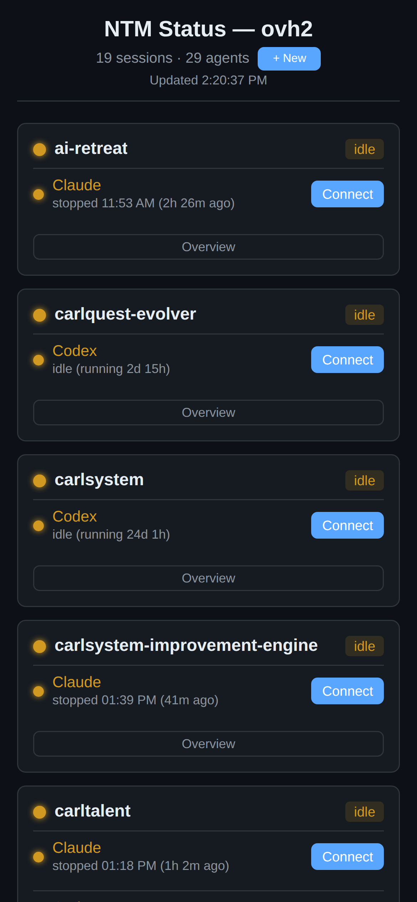

# cc-notify

Push notifications and one-tap deep links for AI agents running in **tmux** on a remote server.

## Table of contents

- [Who this is for](#who-this-is-for)
- [Key features](#key-features)
- [How it works](#how-it-works)
- [Tap-to-connect deep links](#tap-to-connect-deep-links)
- [Notification delivery](#notification-delivery)
- [Prerequisites](#prerequisites)
- [Installation](#installation)
- [Configuration](#configuration)
- [Claude Code hooks setup](#claude-code-hooks-setup)
- [Starting the services](#starting-the-services)
- [Health check](#health-check)
- [Troubleshooting](#troubleshooting)
- [Project structure](#project-structure)
- [Receiving notifications on desktop](#receiving-notifications-on-desktop)
- [Self-hosted ntfy server](#self-hosted-ntfy-server)
- [cc-notify vs Claude Code Remote Control](#cc-notify-vs-claude-code-remote-control)
- [FAQ](#faq)
- [Open tasks](#open-tasks)

## Who this is for

You run Claude Code, Codex, Gemini CLI, or other AI agents inside **tmux sessions** on a VPS, cloud instance, or any machine reachable via SSH. You walk away — to make coffee, take a call, work on something else. When an agent finishes, needs permission, or hits an error, **cc-notify sends a push notification to your phone** with context about what happened. Tap the notification and [Blink Shell](https://blink.sh) opens an SSH connection straight into the exact tmux pane where the agent is waiting.

**tmux is required.** cc-notify discovers sessions by walking the process tree to find parent tmux panes, builds deep links that attach to specific tmux sessions, and creates independent mobile viewports via grouped tmux sessions. Without tmux, the core notification and deep link features do not work.

The remote machine can be anything reachable via SSH — a cloud VPS, a dedicated server, or even your laptop on the same network or connected via [Tailscale](https://tailscale.com).

## Key features

- **Push notifications** via [ntfy](https://ntfy.sh) with rich context (task, last response, project name)
- **Tap-to-connect deep links** via [Blink Shell](https://blink.sh) — one tap from notification to the right tmux pane
- **Any agent in tmux** — Claude Code, Codex, Gemini CLI, or anything else running in a tmux session
- **Smart deduplication** — one notification per project, cooldown resets on interaction
- **Multi-agent dashboard** via optional [NTM](https://github.com/cyanheads/ntm) polling
- **Extensible delivery** — ntfy and Slack built-in; hook architecture pipes to Discord, Telegram, Teams, email, or any webhook with minimal code

## How it works

cc-notify has two notification layers:

1. **Claude Code hook** (`tmux-notify.sh`) — Fires on CC lifecycle events (`Notification`, `Stop`). Extracts context from the session transcript (what task was running, what Claude's last response was). Sends rich notifications with project name, machine name, and context.

2. **NTM agent monitor** (`ntm-notify-monitor.sh`) — Polls [NTM](https://github.com/cyanheads/ntm) health for non-CC agents (Codex, Gemini CLI, etc.) and sends notifications when they go idle or error. Optional — only needed if you run multiple agent types.

Both layers deliver via [ntfy](https://ntfy.sh) (push notifications) out of the box, with built-in Slack support and an extensible hook architecture that can pipe to [any notification service](#notification-delivery).

### Notification types

| Event | Title | Priority |
|-------|-------|----------|
| Permission needed | `machine/project [cc]: Permission Needed` | High |
| Waiting for input | `machine/project [cc]: Waiting for Input` | Default |
| Session finished | `machine/project [cc]: Done` | Default |
| NTM agent idle | `machine/project [agent] p0: Idle` | Default |

### Smart deduplication

You get **one notification per project** when something needs attention, then silence until the cooldown expires (24h default). The cooldown resets when you interact with the session — so you'll get notified again next time it's idle.

## Tap-to-connect deep links

The deep link system is the core UX of cc-notify. When configured, every notification includes a `blinkshell://` URL that opens [Blink Shell](https://blink.sh) on iOS, SSH's into your server, and attaches to the exact tmux session and pane where Claude is waiting — all from a single tap.

### How the deep link flow works

```mermaid
stateDiagram-v2
    [*] --> CC_Event: Claude Code fires hook<br/>(Notification / Stop)

    CC_Event --> SessionDiscovery: tmux-notify.sh runs

    state SessionDiscovery {
        [*] --> WalkProcessTree: Walk PID tree upward
        WalkProcessTree --> FoundSession: Match PID to<br/>tmux pane
        WalkProcessTree --> FallbackProject: No match →<br/>use project name
        FoundSession --> [*]
        FallbackProject --> [*]
    }

    SessionDiscovery --> BuildURL: Session + pane index known

    state BuildURL {
        [*] --> CheckBlinkKey: BLINK_KEY set?
        CheckBlinkKey --> Construct: Yes → build SSH command
        CheckBlinkKey --> NoLink: No → skip deep link
        Construct --> URLEncode: URL-encode via Python
        URLEncode --> BlinkURL: blink URL with key + encoded cmd
        BlinkURL --> [*]
        NoLink --> [*]
    }

    BuildURL --> SendNotification: Notification with deep link

    state SendNotification {
        [*] --> NtfyRequest: POST to ntfy server
        NtfyRequest --> SetHeaders: Set Click + Actions<br/>headers with blink URL
        SetHeaders --> Delivered: Push notification sent
        Delivered --> [*]
    }

    SendNotification --> PhoneNotification: Notification arrives on phone

    state PhoneNotification {
        [*] --> UserTaps: User taps notification<br/>or "Connect" button
        UserTaps --> BlinkOpens: iOS opens<br/>Blink Shell deep link
        BlinkOpens --> [*]
    }

    PhoneNotification --> MobileAttach: Blink Shell executes SSH command

    state MobileAttach {
        [*] --> CleanStale: Kill orphaned mob-* sessions
        CleanStale --> ValidateSession: Target session exists?
        ValidateSession --> CreateGrouped: Yes → create grouped mob-PID session
        ValidateSession --> Error: No → exit with error
        CreateGrouped --> ConfigureViewport: window-size latest<br/>status off
        ConfigureViewport --> SelectPane: select-pane + zoom hook
        SelectPane --> Attach: tmux attach
        Attach --> [*]
    }

    MobileAttach --> Connected: User is in the right<br/>tmux pane, zoomed

    Connected --> [*]: Session ends or<br/>user detaches<br/>(mob-* cleaned up on exit)
```



### What happens when you tap

1. **Notification arrives** — ntfy shows the notification with a "Connect" action button
2. **Tap opens Blink** — iOS launches Blink Shell via the `blinkshell://run?key=...&cmd=...` URL
3. **SSH connects** — Blink runs `ssh -t user@host tmux-mobile-attach.sh SESSION PANE`
4. **Mobile viewport created** — A grouped tmux session (`mob-PID`) gives you an independent viewport sized for your phone screen
5. **Pane zoomed** — The exact pane where Claude is waiting gets selected and zoomed to fill the screen
6. **Cleanup on exit** — When you detach, the `mob-*` session is automatically destroyed

### Why grouped sessions?

The mobile attach script creates a *grouped* tmux session (`mob-$$`) rather than attaching directly. Grouped sessions share the same windows but can have independent settings — which lets mobile get its own `window-size latest` (adapts to phone dimensions) while the real session stays on `window-size largest` (desktop always wins).

**The honest caveat:** tmux fundamentally shares window dimensions across all clients viewing the same window. There is no mode where desktop and mobile have truly independent sizes — this is a tmux architectural constraint, not a bug in cc-notify. In practice:

- **Desktop will briefly resize** when your phone connects (phone dimensions win until tmux enforces `largest`)
- **`window-size largest`** means your desktop terminal always recovers to its own size — but there's a brief flicker on connection
- **Zoom to single pane** (`PANE` argument in the deep link) is what makes mobile usable: your phone fills one pane rather than trying to display your full multi-pane layout at desktop scale
- **On disconnect**, the script unzooms the shared pane and calls `refresh-client` on all desktop clients so the window snaps back cleanly

Other benefits of grouped sessions that do hold:
- Multiple mobile connections don't interfere with each other (each gets its own `mob-*` session)
- Stale connections from dropped SSH sessions are cleaned up automatically
- The `mob-*` session is fully destroyed on detach — no tmux cruft accumulates

### Requirements for deep links

- [Blink Shell](https://blink.sh) installed on iOS
- `BLINK_KEY` set in config (find it in Blink Settings > x-callback-url)
- `SSH_USER` and `SSH_HOST` pointing to your VPS (can be a Tailscale hostname)

> **Without Blink Shell:** Notifications still work — you just won't get the tap-to-connect button. You can still SSH in manually using the session info in the notification body.

<!-- TODO: Add screenshots showing the full user flow:
  1. Notification appearing on iOS lock screen
  2. The "Connect" action button
  3. Blink Shell opening and connecting
  4. The tmux pane zoomed on mobile
-->

<!-- TODO: Add a short (~30s) video walkthrough showing the tap-to-connect
  experience end-to-end. Host on GitHub or link to a public URL.
-->

### NTM dashboard

If you use [ntm](https://github.com/flavio87/cc-notify) to manage multiple agent sessions, the NTM dashboard gives you a live overview of every session from your phone — with per-agent Connect buttons that tap directly into Blink:



Each card shows the session name, which agents are running (Claude, Codex, Gemini), their last active time, and a **Connect** button that fires the same Blink deep link as a notification tap. The **Overview** button attaches to the session's first pane without zooming.

## Notification delivery

cc-notify's hook system extracts rich context from your agent sessions — task name, last response, project, machine, event type — and pipes it to any notification service. ntfy and Slack are built-in. Adding new destinations is straightforward because the architecture is simple: shell functions that receive structured data and `curl` it to an endpoint.

### Built-in destinations

| Destination | Status | Config variable | What you get |
|-------------|--------|-----------------|--------------|
| [ntfy](https://ntfy.sh) | Built-in | `NTFY_TOPIC` | Push notifications on iOS/Android with priority, tags, action buttons, and Blink deep links |
| [Slack](https://slack.com) | Built-in | `SLACK_WEBHOOK_URL` | Formatted messages via incoming webhook with project context |

### Adding new destinations

Each notification destination is a shell function that receives title, priority, body, and the Blink deep link URL. Adding a new one means writing a function in `scripts/ntfy-notify-common.sh` and calling it from the hook. Here's what the most popular integrations look like:

| Destination | Effort | How it works |
|-------------|--------|--------------|
| [Discord](https://discord.com) | ~20 lines | Incoming webhook — almost identical to Slack. POST JSON with `content` and `embeds` to your webhook URL. |
| [Telegram](https://telegram.org) | ~30 lines | Bot API — `curl` POST to `api.telegram.org/bot<TOKEN>/sendMessage` with `chat_id` and formatted text. Create a bot via [@BotFather](https://t.me/botfather). |
| [Pushover](https://pushover.net) | ~15 lines | Simple HTTP API — POST `token`, `user`, `title`, `message`, and optional `url` (for deep link). One of the easiest integrations. |
| [Microsoft Teams](https://www.microsoft.com/en-us/microsoft-teams) | ~30 lines | Incoming webhook or Workflows connector — POST an Adaptive Card JSON payload. |
| [Email](https://en.wikipedia.org/wiki/Email) | ~25 lines | `sendmail`, `msmtp`, or `curl` via SMTP relay. Useful for logging or team-wide alerts. |
| [PagerDuty](https://www.pagerduty.com) | ~35 lines | Events API v2 — POST a `trigger` event with `routing_key`, severity, and summary. Good for on-call workflows. |
| [Gotify](https://gotify.net) | ~15 lines | Self-hosted push server — POST `title` and `message` to your Gotify instance. Similar to ntfy but self-hosted only. |
| Generic webhook | ~10 lines | `curl` POST a JSON payload to any URL. Works with Zapier, Make, n8n, IFTTT, or any HTTP endpoint. |

### Example: adding Discord

```bash
# Add to scripts/ntfy-notify-common.sh
send_discord_notification() {
    local title="$1" priority="$2" body="$3" blink_url="$4"
    [[ -z "${DISCORD_WEBHOOK_URL:-}" ]] && return 0

    local color=3447003  # blue
    [[ "$priority" == "high" || "$priority" == "urgent" ]] && color=15158332  # red

    curl -s -o /dev/null -X POST "$DISCORD_WEBHOOK_URL" \
        -H "Content-Type: application/json" \
        -d "$(jq -n \
            --arg title "$title" \
            --arg body "$body" \
            --arg url "${blink_url:-}" \
            --argjson color "$color" \
            '{embeds: [{title: $title, description: $body, color: $color, url: $url}]}'
        )"
}
```

Then add `DISCORD_WEBHOOK_URL=""` to your `config.env` and call the function from the hook. The same pattern works for any destination.

### Architecture

The hook system is intentionally simple — no plugin framework, no message bus. Each destination is an independent `curl` call fired in the background. This means:

- **No single point of failure** — if Discord's webhook is down, ntfy still delivers
- **No dependencies** — each destination only needs `curl` and `jq`
- **Easy to test** — call any send function directly from the command line
- **Parallel delivery** — all destinations fire concurrently via background jobs

## Prerequisites

- **Required:** [tmux](https://github.com/tmux/tmux) — your agents must run inside tmux sessions
- **Required:** `jq`, `curl`, `python3`
- **Required:** [ntfy](https://ntfy.sh) app on your phone (iOS/Android)
- **Required:** A machine reachable via SSH (VPS, cloud instance, or local machine on Tailscale/LAN)
- **Recommended:** [Blink Shell](https://blink.sh) — iOS SSH client for tap-to-connect deep links
- **Optional:** [NTM](https://github.com/cyanheads/ntm) — needed for the multi-agent monitor

## Installation

```bash
git clone https://github.com/flavio87/cc-notify.git
cd cc-notify
./install.sh
```

The installer:
1. Copies `config.env` template to `~/.config/cc-notify/config.env`
2. Installs scripts to `~/.local/bin/`
3. Installs Claude Code hooks to `~/.claude/hooks/`
4. Installs systemd user units (optional auto-start daemons)

Then edit your config:

```bash
nano ~/.config/cc-notify/config.env
```

## Configuration

All settings live in `~/.config/cc-notify/config.env`:

| Variable | Required | Description |
|----------|----------|-------------|
| `NTFY_TOPIC` | Yes | Unique topic name for your notification channel. Generate one: `python3 -c "import secrets; print(f'cc-notify-{secrets.token_hex(8)}')"` |
| `MACHINE` | No | Display name in notification titles. Defaults to hostname. |
| `SSH_USER` | No | Username for deep link SSH commands. Defaults to current user. |
| `SSH_HOST` | No | Hostname/IP for deep link SSH commands. Defaults to hostname. |
| `NTFY_SERVER` | No | ntfy server URL. Defaults to `https://ntfy.sh` (public). Set to your self-hosted URL if desired. |
| `BLINK_KEY` | No | Blink Shell x-callback-url key for tap-to-connect on iOS. Leave empty to disable deep links. |
| `SLACK_WEBHOOK_URL` | No | Slack incoming webhook URL for dual delivery. Leave empty to disable. |
| `PROJECTS_DIR` | No | Directory containing your project repos. Defaults to `$HOME/projects`. Used by the NTM monitor for session matching. |
| `NOTIFY_EXCLUDE_DIRS` | No | Colon-separated path prefixes that will never trigger notifications. Example: `/data/notes:/home/user/scratch`. Useful for personal notes or low-signal dirs. |

## Claude Code hooks setup

Add to your Claude Code settings (`~/.claude/settings.json`):

```json
{
  "hooks": {
    "Notification": [
      {
        "matcher": "",
        "hooks": ["~/.claude/hooks/tmux-notify.sh"]
      }
    ],
    "Stop": [
      {
        "matcher": "",
        "hooks": ["~/.claude/hooks/tmux-notify.sh"]
      }
    ],
    "UserPromptSubmit": [
      {
        "matcher": "",
        "hooks": ["~/.claude/hooks/ntfy-cooldown-clear.sh"]
      }
    ]
  }
}
```

The `Notification` hook fires on permission prompts and idle events. The `Stop` hook fires when a session finishes. The `UserPromptSubmit` hook clears the cooldown so you'll get notified again next time.

## Starting the services

```bash
# NTM agent monitor (optional — only if you use NTM)
systemctl --user enable --now ntm-notify-monitor

# NTM serve daemon (optional — powers the dashboard)
systemctl --user enable --now ntm-serve

# Status dashboard (optional — web UI at port 7338)
systemctl --user enable --now ntm-dashboard
```

## Health check

Run the built-in health check to verify your setup:

```bash
ntfy-health-check.sh              # check config + tools
ntfy-health-check.sh --send-test  # also send a test notification
```

## Troubleshooting

**No notifications received:**
1. Run `ntfy-health-check.sh --send-test` — does the test notification arrive?
2. Check `NTFY_TOPIC` in your config matches the topic you subscribed to in the ntfy app
3. Check logs: `cat /tmp/cc-notify-logs/tmux-notify.log`

**Duplicate notifications:**
- The cooldown system should prevent these. Check: `ls -la /tmp/cc-notify-cooldown/`
- Default cooldown is 24h. Override with `NTFY_COOLDOWN_SECONDS` in config.

**Deep links not working:**
- Blink Shell deep links require `BLINK_KEY` to be set. Find it in Blink Settings > x-callback-url.
- Other SSH clients: set `SSH_USER` and `SSH_HOST`, then use the notification body to manually SSH in.

**NTM monitor not detecting agents:**
- Verify NTM is installed: `ntm --version`
- Check if sessions are visible: `ntm health --json`
- Logs: `cat /tmp/cc-notify-logs/ntm-notify-monitor.log`

## Project structure

```
hooks/                  # Claude Code lifecycle hooks
  tmux-notify.sh          # Main notification hook (Notification + Stop events)
  ntfy-cooldown-clear.sh  # Cooldown reset on user interaction
scripts/                # Core scripts
  ntfy-notify-common.sh   # Shared library (config, logging, deep links, sending)
  ntm-notify-monitor.sh   # NTM agent polling monitor
  ntm-dashboard-server.py # Status dashboard HTTP server
  ntfy-health-check.sh    # Pipeline health check
  ntfy-broadcast-status.sh # Broadcast status to all subscribers
  tmux-mobile-attach.sh   # SSH helper for mobile deep links
dashboard/              # Web dashboard
  status.html             # Mobile-first status page
systemd/                # Linux systemd user units
  ntm-notify-monitor.service
  ntm-dashboard.service
  ntm-serve.service
  ft-watch.service        # Optional FrankenTerm integration
launchd/                # macOS launchd agents
desktop/                # macOS desktop integration (AppleScript, handlers)
server/                 # Self-hosted ntfy server config (Docker)
config.env              # Configuration template
install.sh              # Installer
```

## Self-hosted ntfy server

If you prefer not to use the public ntfy.sh server, the `server/` directory includes a Docker Compose setup:

```bash
cd server
docker compose up -d
```

Edit `server/server.yml` with your domain, then set `NTFY_SERVER` in your config.

## Receiving notifications on desktop

The ntfy app handles iOS and Android natively. For desktop, you have two paths: ntfy (macOS-specific options) or Slack (works everywhere).

### macOS

Three options depending on your hardware:

**Safari PWA — simplest, any Mac (macOS Sonoma+)**

Works on any Mac running macOS 14 (Sonoma) or later. No app to install.

1. Open Safari and go to your ntfy server (e.g. `https://ntfy.sh` or your self-hosted URL)
2. Subscribe to your `NTFY_TOPIC`
3. Click **Share → Add to Dock**
4. macOS will ask for notification permission — allow it
5. Notifications arrive even when Safari is closed

**Limitation:** Safari Web Push is silent (no sound). If you need sound, use one of the options below.

**Official ntfy app — full features, Apple Silicon only**

The [official ntfy app](https://apps.apple.com/us/app/ntfy/id1625396347) is on the Mac App Store (free, by ntfy's author). Supports sound, action buttons, formatted messages, and self-hosted servers. **Requires M1 or later** — Intel Macs not supported.

1. Install ntfy from the Mac App Store
2. Open the app → tap **+**
3. Enter your ntfy server URL and topic
4. Enable notifications in **System Settings → Notifications → ntfy**

**ntfy-desktop — Intel + Apple Silicon, polling-based**

[ntfy-desktop by Aetherinox](https://github.com/Aetherinox/ntfy-desktop) is an Electron app that works on all Macs. Polls for notifications rather than using Web Push — slightly higher resource usage but works on Intel.

1. Download the latest `.dmg` from [GitHub releases](https://github.com/Aetherinox/ntfy-desktop/releases)
2. Open the `.dmg`, drag ntfy-desktop to Applications
3. Launch it — runs in the system tray
4. Click **+** to add your topic and server URL

| | Sound | Background delivery | Intel Mac | Self-hosted |
|---|---|---|---|---|
| Safari PWA | Silent only | Yes (Web Push) | Yes | Yes |
| Official app | Yes | Yes (Web Push) | No (M1+ only) | Yes |
| ntfy-desktop | Yes | Yes (polling) | Yes | Yes |

### macOS, Windows, Linux — via Slack

Set `SLACK_WEBHOOK_URL` in your config and every notification also posts to a Slack channel. The Slack desktop app delivers these as native OS notifications with sound on any platform. No extra setup beyond the webhook — and it means your agents can page both your phone (ntfy) and your desktop (Slack) at the same time.

## cc-notify vs Claude Code Remote Control

Claude Code now has a built-in [Remote Control](https://docs.anthropic.com/en/docs/claude-code/remote-control) feature — connect to running sessions from your phone via `claude.ai/code` or the Claude iOS app, scan a QR code, auto-reconnect after sleep. These two tools solve overlapping problems in different ways, and they can work together.

The key context: **Remote Control doesn't require tmux** — it works with any Claude Code session. **cc-notify requires tmux** — but in exchange gives you push notifications, deep links, multi-agent support, and a full terminal experience. If you already run your agents in tmux (which most VPS-based workflows do), cc-notify adds a layer that Remote Control can't.

### Two different philosophies

**Remote Control** gives you a web-based window into a single Claude Code session. You open the app, find the session, see what's happening, type a response. It's a remote viewer for Claude Code. It doesn't require any particular terminal setup.

**cc-notify + Blink Shell** is built for tmux-based workflows. You run your agents in tmux sessions on a remote machine. cc-notify watches those sessions, pushes notifications when something needs attention, and gives you one-tap deep links that land you in the right tmux pane via Blink Shell — with your full terminal environment, layout, and tools.

### Comparison across five dimensions

#### 1. Awareness — how do you know something needs attention?

This is the fundamental difference.

| | Remote Control | cc-notify + Blink |
|---|---|---|
| **Permission prompt** | You don't know until you open the app and check | Push notification hits your lock screen instantly |
| **Task finished** | You don't know until you check | Push notification with context about what finished |
| **Agent idle/errored** | You don't know until you check | Push notification per-project |
| **Multiple agents blocked** | Check each session one by one | One notification per blocked agent, each with its own deep link |

Remote Control has **no push notifications** as of today — this is an [open feature request](https://github.com/anthropics/claude-code/issues/29438). You must actively poll the web UI. If you walk away from your phone, you have no idea when Claude needs you.

cc-notify is built around the opposite model: you walk away, and **it finds you** when something needs attention.

#### 2. Getting there — how do you connect?

| | Remote Control | cc-notify + Blink |
|---|---|---|
| **Initial setup** | `/remote-control` in session, scan QR | Install cc-notify, configure ntfy + Blink key |
| **Reconnecting** | Open Claude app → find session | Tap notification → Blink opens → SSH → tmux pane (one tap) |
| **What you land in** | Web-based terminal in a browser/app | Native terminal (Blink Shell) attached to your tmux session |
| **Pane targeting** | Lands in the session (no pane control) | Deep link targets the exact pane where Claude is waiting, zoomed |

The deep link flow in cc-notify means you go from lock screen to the right tmux pane in a single tap. Blink Shell handles the SSH connection, `tmux-mobile-attach.sh` creates an independent mobile viewport, selects the pane, and zooms it. No manual SSH, no finding the session, no navigating panes.

#### 3. The experience once connected

| | Remote Control | cc-notify + Blink |
|---|---|---|
| **Interface** | Web UI (responsive, but browser-based) | Full native terminal via Blink Shell |
| **Send prompts** | Yes, via web editor | Yes, via Blink terminal (full keyboard, shell access) |
| **See live output** | Yes, in the web view | Yes, in your real tmux session |
| **Access other tools** | No — scoped to the CC session | Yes — full shell, other panes, vim, git, anything |
| **Custom tmux layouts** | No — web renders its own view | Yes — your desktop layout is preserved; mobile gets an independent viewport |
| **Terminal features** | Limited (web rendering) | Full (Blink supports mosh, key forwarding, themes, fonts) |

Both let you see what Claude is doing and send prompts. The difference is depth: Remote Control gives you a Claude-scoped web view, while Blink gives you your full terminal environment. If you need to check a log file, run a test, or peek at another pane while Claude is waiting — Blink has it, Remote Control doesn't.

#### 4. Scale — multiple agents and projects

| | Remote Control | cc-notify + Blink |
|---|---|---|
| **Multiple CC sessions** | Switch between sessions in web UI | One notification per session, each with its own deep link |
| **Dashboard / overview** | Session list in web UI | NTM dashboard shows all agents with status, health, uptime |
| **Non-CC agents** (Codex, Gemini CLI, etc.) | Not supported | Fully supported via NTM polling |
| **Per-project deduplication** | N/A | One notification per project, cooldown until you interact |

This is where the gap is widest. If you run multiple agents across projects — especially mixed agent types — Remote Control has no way to aggregate or notify. cc-notify with NTM gives you a single dashboard plus targeted notifications.

#### 5. Infrastructure and privacy

| | Remote Control | cc-notify + Blink |
|---|---|---|
| **Traffic routing** | Session data through Anthropic's servers | Direct SSH to your VPS (nothing leaves your infra) |
| **Self-hosted option** | No | Yes — self-hosted ntfy server |
| **Multi-destination delivery** | No | Yes — ntfy, Slack, Discord, Telegram, Teams, email, any webhook |
| **Notification history** | None — ephemeral web session | ntfy retains a searchable timeline |
| **Offline tolerance** | ~10 min timeout, then session drops | tmux sessions persist indefinitely; reconnect anytime |

### When to use which

| Scenario | Best tool | Why |
|----------|-----------|-----|
| Quick check on a single CC session from your couch | **Remote Control** | Simplest path — QR code, zero config |
| Walk away for hours, come back only when needed | **cc-notify** | Push notifications mean you don't waste time polling |
| Running 3+ CC agents across different projects | **cc-notify + NTM** | Per-project notifications + dashboard overview |
| Mixed agents (CC + Codex + Gemini CLI) | **cc-notify + NTM** | Only option — Remote Control is CC-only |
| tmux power user (custom layouts, splits, persistent sessions) | **cc-notify + Blink** | You stay in your real terminal environment |
| Need to check logs, run tests, or use other tools from mobile | **cc-notify + Blink** | Full shell access, not just a CC session view |
| Both — interactive when active, async when away | **Both together** | Remote Control for in-the-moment work, cc-notify for "tap me when it's time" |

### They're complementary

You don't have to choose. Remote Control is great for interactive check-ins when you're actively working from your phone. cc-notify is great for the other 90% of the time — when you've walked away and need to know the moment something needs attention, then get back to the right place in one tap.

## Other integrations

- **FrankenTerm**: File watcher integration via the `ft-watch` systemd unit. See `systemd/ft-watch.service`.
- **NTM**: Multi-agent session management. The monitor script polls NTM health for state transitions. Not required for basic CC notifications.

## FAQ

### Do I need an iPhone or Blink Shell?

**No.** The push notifications work on any phone with the ntfy app (iOS or Android). The Blink Shell deep links are an iOS-specific bonus — without them, you still get notifications with full context (project name, what Claude was doing, what it said). You just connect to your server via your preferred SSH client instead of getting the one-tap experience. Android deep link support (equivalent to the Blink Shell integration on iOS) is not yet implemented — contributions welcome. See [open tasks](#open-tasks).

### Does this work with agents other than Claude Code?

**Yes.** The Claude Code hook (`tmux-notify.sh`) fires on CC lifecycle events specifically, but the NTM agent monitor (`ntm-notify-monitor.sh`) works with any agent that runs in a tmux session — Codex, Gemini CLI, Aider, or custom scripts. NTM polls session health regardless of what agent is inside it.

### Can I use this on a laptop instead of a VPS?

**Yes** — as long as the machine is reachable via SSH. If your laptop is on the same network, local SSH works. For remote access, [Tailscale](https://tailscale.com) makes any machine reachable by its Tailscale hostname or IP without port forwarding or dynamic DNS. Set `SSH_HOST` to your Tailscale address and deep links work from anywhere.

### Can I self-host everything?

**Yes.** ntfy can be [self-hosted](https://docs.ntfy.sh/install/) via Docker (config included in `server/`). SSH is direct to your machine. The NTM dashboard runs locally. No data needs to leave your infrastructure. The only external dependency is the ntfy mobile app, which connects to your self-hosted server instead of ntfy.sh.

### Can multiple people get notifications for the same server?

**Yes.** ntfy is topic-based — anyone who subscribes to the same topic receives notifications. You can also set up separate topics per person or per project, or use Slack webhook delivery for team-wide visibility.

### What happens if my SSH connection drops mid-session?

The mobile viewport (`mob-*` grouped session) is cleaned up automatically. Your actual tmux session and the agent inside it are unaffected — tmux sessions persist until explicitly killed. The next notification will include a fresh deep link to reconnect.

### How is this different from just using `notify-send` or `osascript` in a hook?

Those are local desktop notifications — they only work if you're sitting at the machine. cc-notify sends push notifications to your phone via ntfy, adds Blink Shell deep links for one-tap reconnection, handles per-project deduplication with cooldowns, extracts rich context from the agent's transcript, and optionally pipes to Slack, Discord, or any other service. It's the difference between "beep on my desktop" and "page me on my phone with context and a connect button."

### I only run one Claude Code session. Is this overkill?

Maybe. If you're running a single session and check your phone regularly, Claude Code's [Remote Control](https://docs.anthropic.com/en/docs/claude-code/remote-control) might be simpler — it's built-in, zero config, and gives you a web view. But if you walk away and want to know the *moment* Claude needs you (instead of discovering it 20 minutes later), the push notification alone is worth the setup. The install takes under 5 minutes.

### Can I send notifications to Discord / Telegram / Teams / email?

**Yes.** The hook architecture pipes structured data (title, priority, body, deep link URL) to shell functions that `curl` endpoints. ntfy and Slack are built-in; adding a new destination is ~15-35 lines of bash. See the [Notification delivery](#notification-delivery) section for integration guides and a Discord example.

## Open tasks

Known gaps and contributions welcome:

- **Android deep links** — the iOS tap-to-connect flow uses Blink Shell's `blinkshell://` URI scheme. An equivalent for Android (e.g. via [Termux](https://termux.dev) intent URIs or another SSH client that supports deep links) is not yet implemented.
- **Screenshots and demo video** — a 30-second screen recording of the full notification → tap → tmux pane flow would make the README significantly more useful.

## License

MIT — see [LICENSE](LICENSE).
